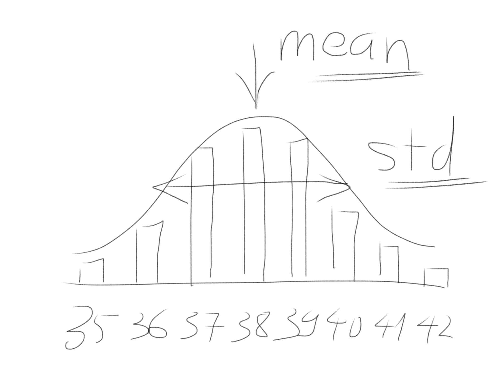
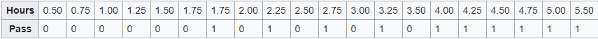
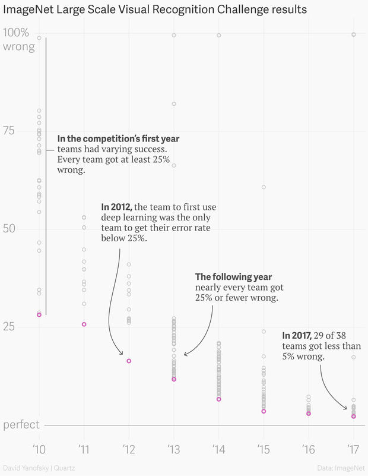

Trong lịch sử loài người, việc biến thực tế phức tạp trở thành mô hình đơn giản hơn và ước lượng outcome chưa xảy ra dựa vào mô hình đã trở thành một phần của quá trình tiến hóa.

Bằng bộ não, hệ thần kinh và 5 giác quan, chúng ta làm điều này liên tục, cho dù có nhận ra là mình đang làm hay không.

# Statistics

Giả sử tôi là một nhà bán giày ở thế kỷ 19, tôi sắp sửa bán ra thị trường một loại giày mới.

Để biết mình nên nhập về số lượng bao nhiêu cho một cỡ giày nhất định, tôi đưa hình ảnh cho khách tới tham quan cửa hàng và hỏi họ có sẵn sàng mua hay không?

Từ dữ liệu đó, tôi vẽ được biểu đồ như dưới đây - trục dọc tương ứng với lượng khách trả lời "Có" và trục ngang là cỡ giày. Vậy những size giày khách có khả năng mua nhiều nhất lần lượt là các cỡ 38, 39, 37.

Biểu đồ này có dạng hình quả chuông nên thường được gọi là Bell Curve, còn kỹ thuật hơn là Frequency Distribution (phân phối tần suất) — và quá trình hỏi khách hàng được gọi là lấy mẫu hay Sampling.

Đây chính là toán thống kê — hay Statistics.

Mỗi distribution được đại diện bởi 2 con số quan trọng nhất là giá trị trung bình (hay Mean value) và độ lệch chuẩn — hay dung sai chuẩn (hay Standard Deviation).

Một cách đơn giản hóa hơi quá, chúng tương đương với vị trí đỉnh và độ rộng của quả chuông.

Ví dụ trên nói về dạng phân phối lý tưởng gọi là Normal Distribution — phân phối chuẩn.

Trên thực tế, dữ liệu rất đa dạng và có thể xuất hiện nhiều dạng phân phối abnormal — không chuẩn khác, đại diện bởi các loại biểu đồ trong hình dưới đây

# Machine Learning

Machine Learning truyền thống chủ yếu tìm cách xác định đường cong phân phối để predict outcome. Consider ví dụ sau đây về hồi quy Logarithm — Logistic Regression.

(Đây là một trong những thuật toán machine learning phổ biến nhất bởi tính dễ thực hiện và hữu dụng trong nhiều trường hợp dữ liệu không quá phức tạp.)

Đề bài: có 20 học sinh cùng ôn thi với số giờ ôn thi và kết quả thi như bảng sau (pass=1, fail=0).

Từ dữ liệu này, sử dụng Logistic Regression, ta có thể vẽ được đường cong màu xanh — tương đương với (nửa bên trái của) đường cong phân phối trong ví dụ trước.

Kết quả cho thấy để có xác suất qua môn ≥ 75% thì một học sinh nên học ít nhất khoảng 3.5 giờ. 

# Deep Learning

## (một sub field của Machine Learning)

Nếu bạn từng sở hữu smartphone với Google Assistant hay Siri, laptop với Cortana hay loa Google Home điều khiển bằng giọng nói, bạn đã tương tác với mạng neuron được huấn luyện nhờ thuật toán Deep Learning.

Deep Learning cho tỷ lệ chính xác cao tới 95-99% trong nhiều bài toán phức tạp mà con người không có cách định nghĩa quy luật bằng công thức toán học thông thường. Ví dụ như bài toán nhận dạng từ ngữ trong sample âm thanh, hay nhận dạng người, vật trong hình ảnh.

Vậy bằng cách nào chúng ta đi từ Machine Learning sang Deep Learning?

Vào cuối thập niên 1950s, đầu 1960s, một số nhà khoa học bắt đầu thử nghiệm giả lập cách bộ não hoạt động trên máy tính để nhận dạng hình ảnh. Ví dụ demo đầu tiên là 1 chiếc máy tính nhận diện được hình tròn, vuông, tam giác nhờ sử dụng 1 neuron.

Sau này, có nhiều nghiên cứu khác sử dụng nhiều neuron hơn kết nối với nhau thành mạng neuron (neural network) nhưng kết quả chưa bao giờ vượt qua được các thuật toán Machine Learning truyền thống. Thời kỳ này được coi là mùa đông của AI research.

Mãi tới năm 2012, 2 nghiên cứu sinh được dẫn dắt bởi GS. Geoffrey Hinton tại ĐH Toronto, Canada mới đạt được bước đột phá trong nhận diện hình ảnh nhờ sử dụng thuật toán Deep Learning.

Họ trở thành team duy nhất đạt sai số < 25% trên kho dữ liệu ImageNet năm đó.

References

[https://frontendmasters.com/courses/practical-machine-learning/](https://frontendmasters.com/courses/practical-machine-learning/)

[https://en.wikipedia.org/wiki/Logistic_regression#:~:text=Logistic regression is a statistical,a form of binary regression](https://en.wikipedia.org/wiki/Logistic_regression#:~:text=Logistic%20regression%20is%20a%20statistical,a%20form%20of%20binary%20regression)

[https://qz.com/1034972/the-data-that-changed-the-direction-of-ai-research-and-possibly-the-world/](https://qz.com/1034972/the-data-that-changed-the-direction-of-ai-research-and-possibly-the-world/)

